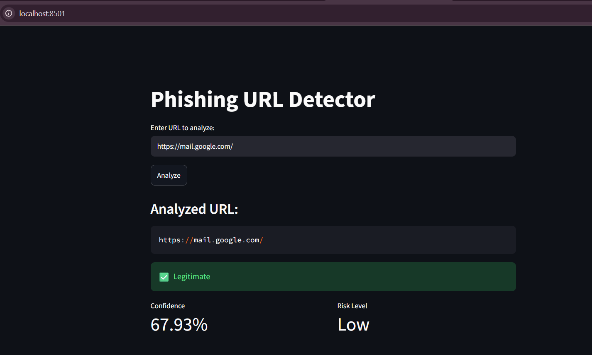
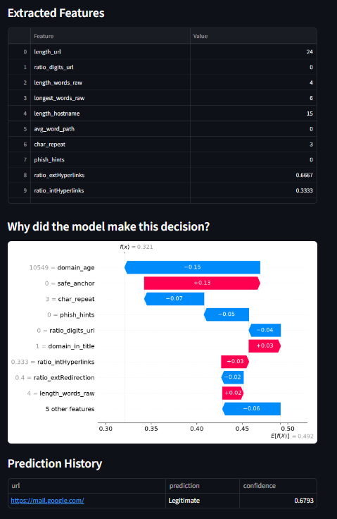
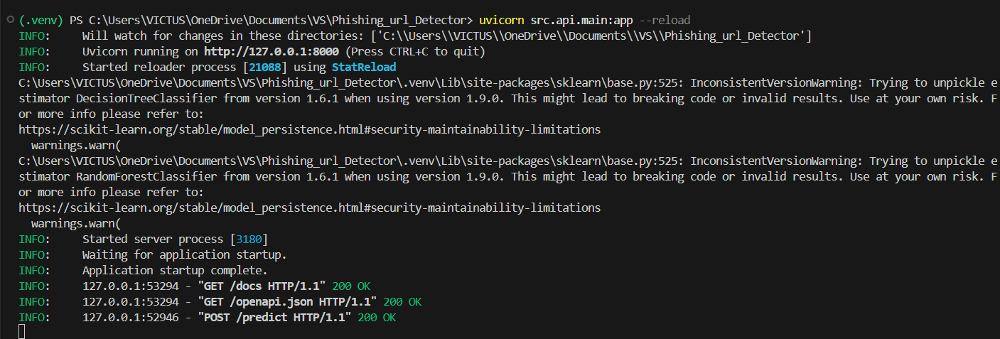
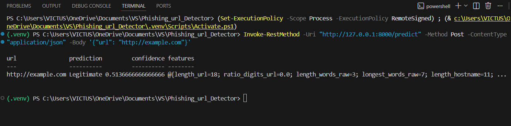
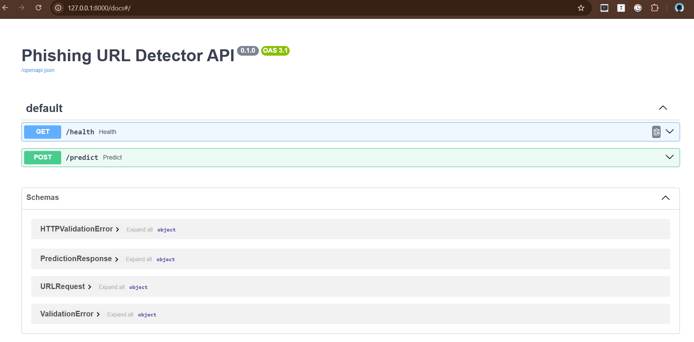
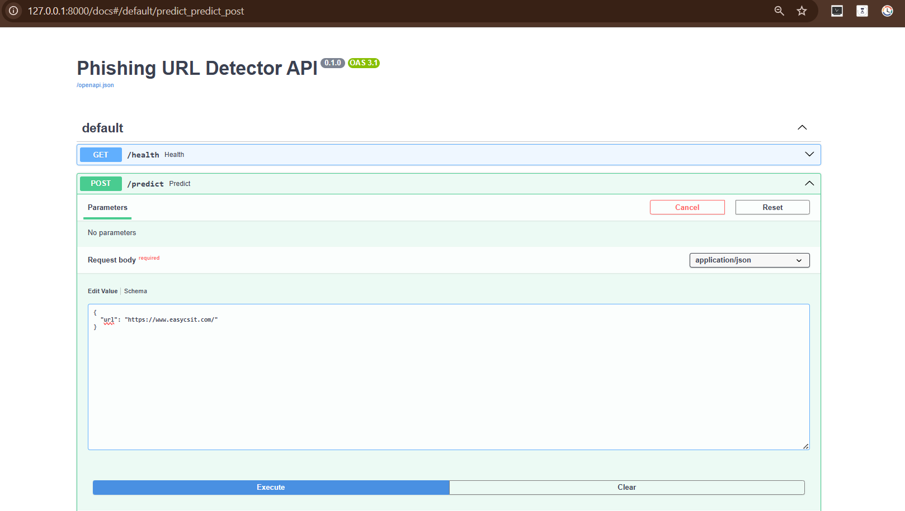
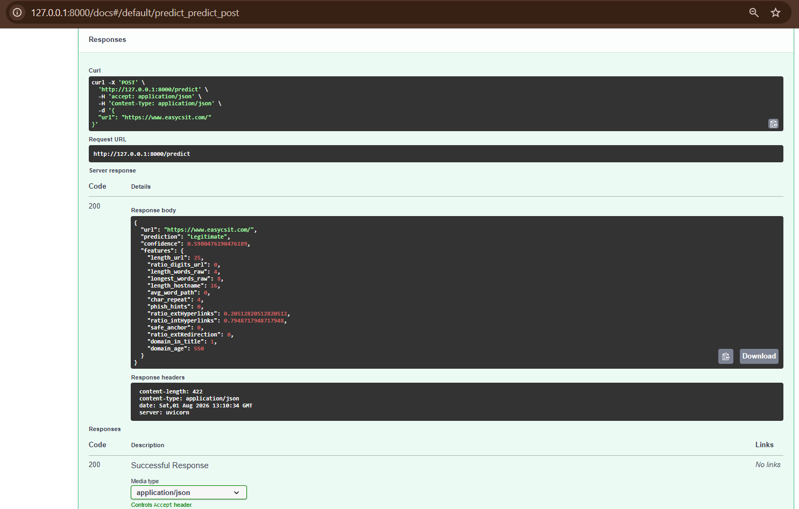

# Phishing URL Detector

A machine learning system that detects phishing URLs using URL structure, HTML content, and WHOIS domain data. Includes a Streamlit web app, a FastAPI backend, and SHAP-based explainability.

## Features

- **URL-based features**: length, digit ratio, token count, character repetition, hostname length
- **HTML-based features**: phishing keyword detection, internal/external link ratios, redirect analysis
- **WHOIS-based features**: domain age
- **Model**: Random Forest Classifier (~92% accuracy, ~0.92 F1 score)
- **Explainability**: SHAP waterfall plots showing why the model made each decision
- **Streamlit app**: interactive UI for single-URL analysis
- **FastAPI backend**: REST API for programmatic predictions

## Project Structure

```
├── app.py                          # Streamlit UI
├── src/
│   ├── api/                        # FastAPI backend
│   ├── feature_extraction/         # URL, HTML, WHOIS feature extractors
│   └── prediction/                 # Model loading and prediction logic
├── explainability/                 # SHAP explainer
├── models/                         # Trained model (.pkl)
├── data/                           # Raw and processed datasets
├── notebooks/                      # EDA and model training notebooks
└── requirements.txt
```

## Setup

```bash
git clone <repo-url>
cd Phishing_url_Detector
python -m venv .venv
.venv\Scripts\activate        # Windows
pip install -r requirements.txt
```

## Exploratory Data Analysis

- Loaded the phishing dataset into a Pandas DataFrame and inspected row/column counts, data types, missing values, and duplicates.
- Analyzed class distribution, feature value distribution, and correlation between features.
- Identified which features are strong indicators of phishing behavior.

**Key observations:**
- The dataset contains both legitimate and phishing websites.
- Several URL-based features show strong correlation with phishing behavior.
- Some features can be extracted directly from URLs, while others require HTML content or external services such as WHOIS and SSL information.

**Feature categories:**

*URL-based* (extracted directly from the URL): URL length, number of dots, number of hyphens, presence of IP address, number of subdomains, presence of special characters.

*HTML-based* (require webpage scraping): external resource ratio, number of links, forms and redirects, favicon source.

## Running the Streamlit app

```bash
streamlit run app.py
```





## Running the FastAPI backend

```bash
uvicorn src.api.main:app --reload
```

**Server startup:**



**Interactive docs at `/docs`:**



**Testing the /predict endpoint via "Try it out":**



**Request body:**



**Response:**



## Model Performance

| Metric    | Score |
|-----------|-------|
| Accuracy  | 0.92  |
| Precision | 0.90  |
| Recall    | 0.93  |
| F1 Score  | 0.92  |

## Contributors

- Nwang Chheten Lama
- Shubham Adhikari